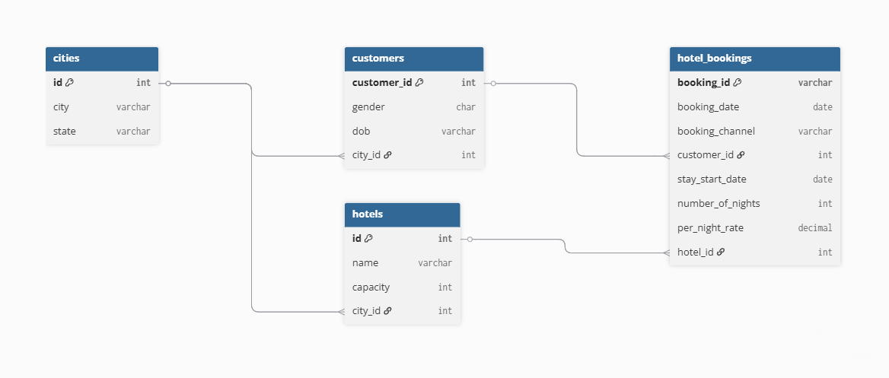

# Hotel Booking SQL Case Study

This repository contains an end-to-end SQL case study analyzing hotel booking data across multiple hotels and cities in India.

The project focuses on solving real-world business questions related to customer behavior, booking patterns, revenue contribution, occupancy trends, and operational performance using SQL.

## Dataset Overview

The dataset represents a hotel booking system with four core entities:

- **customers** – customer demographics and home city  
- **hotels** – hotel details, capacity, and location  
- **cities** – city and state mapping  
- **hotel_bookings** – booking-level transactional data

The tables are linked using foreign keys to enable customer, geographic, revenue, and occupancy analysis.

## Database Schema

The diagram below illustrates the relationships between customers, hotels, cities, and hotel bookings.

## Business Questions Covered

This case study answers 14 real-world business questions, including:

- Same-city vs out-of-city booking behavior  
- Customer travel across multiple states  
- Revenue contribution by booking channel and gender  
- Monthly occupancy rates and fully occupied dates  
- Advance booking patterns  
- Revenue by customer generation (Millennials vs Gen Z)

Full problem statements and SQL solutions are available in the repository.

## SQL Concepts Demonstrated

- Multi-table joins across normalized schemas  
- Conditional aggregation using CASE WHEN  
- Window functions (RANK, COUNT OVER, SUM OVER)  
- Recursive CTEs for date expansion  
- Time-based occupancy and capacity analysis
